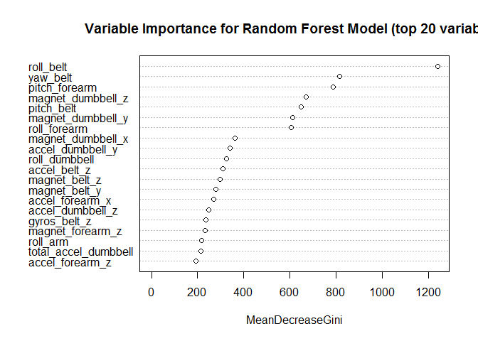

# Practical Machine Learning Assignment
Ken H.  
2015-09-24  


## Introduction

In this assignment for the Johns Hopkins Bloomberg School of Public Health 
"Practical Machine Learning" course (as presented via Coursera), we are tasked 
with developing a machine learning algorithm that will allow us to create a 
model for assessing the quality of a certain category of weight lifting 
excercise from data gathered from various test subjects. 

The data used for the assignment was gathered as part of a Human Activity 
Recognition (HAR) study[^velloso], and was graciously provided for our use by 
the website [http://groupware.les.inf.puc-rio.br/har](http://groupware.les.inf.puc-rio.br/har).

[^velloso]: Velloso, E.; Bulling, A.; Gellersen, H.; Ugulino, W.; Fuks, H. [Qualitative Activity Recognition of Weight Lifting Exercises](http://groupware.les.inf.puc-rio.br/public/papers/2013.Velloso.QAR-WLE.pdf). Proceedings of 4th International Conference in Cooperation with SIGCHI (Augmented Human '13) . Stuttgart, Germany: ACM SIGCHI, 2013. 

Data was gathered by sensors attached to the test subjects' torso, arm, and 
forearm as well as to the dumbell they used during the data capture. The 
sensors measured three axes each of acceleration, gyroscopic, and magnetometer 
data.

The test subjects, six young adult males with little prior weight lifting 
experience, were asked to perform one set of 10 repetitions of the Universal 
Dumbell Biceps Curl in five manners, one correct (Class A, exactly according to the 
specification), and four incorrect (Class B, throwing the elbows to the 
front; Class C, lifting the dumbell only halfway; Class D, lowering the dumbell 
only halfway; and Class E, throwing the hips forward).

## Data

### Getting the Data


We were provided with links to two CSV files for this assignment, one for 
[training](https://d396qusza40orc.cloudfront.net/predmachlearn/pml-training.csv), 
and one for [testing](https://d396qusza40orc.cloudfront.net/predmachlearn/pml-testing.csv). 
The CSV files were downloaded and read into R data frames using the `readr` 
package.

The training CSV file contained 19622 rows and 
160 columns of data. The testing CSV file contained 
20 rows and 160 columns of data.

### Cleaning the Data


During inital exploratory analysis of the provided data, I noticed that there 
were numerous columns in the dataset that were either identification columns, 
or contained aggregate data from other columns (identified by their names being
prefixed with one of `min`, `max`, `avg`, `var`, `stddev`, `kurtosis`, 
`skewness`, or `amplitude`). I removed these columns from the dataset to 
avoid fitting my model to anything other than sensor data, and to avoid errors 
caused by missing data in the aggregate columns.

This cleaning resulted in the training dataset being reduced to
53 columns.

The training dataset has a column named `classe` that contains the class 
assigned by the study authors to the data in each row of sensor readings. In 
order to use this column in the training algorithm I converted it to a factor 
data type column. This column is missing from the test dataset, replaced by a 
column named `problem_id` that I left as-is for prediction result 
identification.

### Splitting into Training and Validation Partitions


In order to perform model validation I partitioned the training dataset into 
separate training and validation datasets. I arbitrarily chose to split the 
dataset using a 80% / 20% random allocation of rows from 
the training dataset to the new training and validation datasets, respectively.

This resulted in there being 15699 rows in the new training 
dataset, and 3923 rows in the validation dataset.

## Model

### Model Generation


In reading the Coursera Discussion Forums for this course, I learned that 
models can be very time consuming to calculate, but that running the training 
on multiple processor cores in parallel can reduce the amount of time taken to 
process the data. Based on this, I chose to run my training using the 
`doParallel` package. 

Analysis and model generation were  performed using the functions of the 
`caret` package. I tried using four different models, namely `rf` for random 
forests, `gbm` for stochastic gradient boosting, `knn` for k-nearest neighbors, 
and `lda` for linear discriminant analysis. Random forests came out with the 
highest accuracy. In the interest of brevity, I have chosen to only present the 
results of the random forest model in this report.

In my intial runs using random forest training I used the cross-validation 
resampling method (`cv`), but settled on using the out-of-bag resampling method 
(`oob`). This change resulted in an approximately 0.45% increase in accuracy.

Following is the final model as reported by `caret`:


```

Call:
 randomForest(x = x, y = y, mtry = param$mtry) 
               Type of random forest: classification
                     Number of trees: 500
No. of variables tried at each split: 13

        OOB estimate of  error rate: 0.46%
Confusion matrix:
     A    B    C    D    E class.error
A 4461    3    0    0    0 0.000672043
B   11 3020    7    0    0 0.005924951
C    0   18 2717    3    0 0.007669832
D    0    0   22 2550    1 0.008938982
E    0    0    2    6 2878 0.002772003
```

The plot of the top 20 model predictors can be seen below:

 

### Model Validation


I used the validation dataset I split previously from the data to validate the 
model, calculating the following confusion matrix:


```
Confusion Matrix and Statistics

          Reference
Prediction    A    B    C    D    E
         A 1113    1    0    0    0
         B    2  756    1    0    0
         C    1    2  683    5    0
         D    0    0    0  638    1
         E    0    0    0    0  720

Overall Statistics
                                          
               Accuracy : 0.9967          
                 95% CI : (0.9943, 0.9982)
    No Information Rate : 0.2845          
    P-Value [Acc > NIR] : < 2.2e-16       
                                          
                  Kappa : 0.9958          
 Mcnemar's Test P-Value : NA              

Statistics by Class:

                     Class: A Class: B Class: C Class: D Class: E
Sensitivity            0.9973   0.9960   0.9985   0.9922   0.9986
Specificity            0.9996   0.9991   0.9975   0.9997   1.0000
Pos Pred Value         0.9991   0.9960   0.9884   0.9984   1.0000
Neg Pred Value         0.9989   0.9991   0.9997   0.9985   0.9997
Prevalence             0.2845   0.1935   0.1744   0.1639   0.1838
Detection Rate         0.2837   0.1927   0.1741   0.1626   0.1835
Detection Prevalence   0.2840   0.1935   0.1761   0.1629   0.1835
Balanced Accuracy      0.9985   0.9975   0.9980   0.9960   0.9993
```

As can be seen, this indicates an estimated accuracy of 
0.9967, with a 95% confidence interval of 
0.9943---
0.9982. This 
represents an estimated out-of-sample error of 
0.3314%.

## Assignment Prediction


I ran a new prediction using my model against the testing data provided for 
the assignment and submitted the results to Coursera: my predictions scored 
20 out of 20 (100%)!

## Appendix

### Environment Information


```
R version 3.2.2 (2015-08-14)
Platform: x86_64-w64-mingw32/x64 (64-bit)
Running under: Windows 8 x64 (build 9200)

locale:
[1] LC_COLLATE=English_Canada.1252  LC_CTYPE=English_Canada.1252   
[3] LC_MONETARY=English_Canada.1252 LC_NUMERIC=C                   
[5] LC_TIME=English_Canada.1252    

attached base packages:
[1] parallel  stats     graphics  grDevices utils     datasets  methods  
[8] base     

other attached packages:
[1] randomForest_4.6-10 readr_0.1.1         knitr_1.11         
[4] caret_6.0-52        ggplot2_1.0.1       lattice_0.20-33    
[7] doParallel_1.0.8    iterators_1.0.7     foreach_1.4.2      

loaded via a namespace (and not attached):
 [1] Rcpp_0.12.1         compiler_3.2.2      formatR_1.2.1      
 [4] nloptr_1.0.4        plyr_1.8.3          class_7.3-14       
 [7] tools_3.2.2         digest_0.6.8        lme4_1.1-9         
[10] evaluate_0.8        nlme_3.1-122        gtable_0.1.2       
[13] mgcv_1.8-7          Matrix_1.2-2        yaml_2.1.13        
[16] brglm_0.5-9         SparseM_1.7         proto_0.3-10       
[19] e1071_1.6-7         BradleyTerry2_1.0-6 stringr_1.0.0      
[22] gtools_3.5.0        MatrixModels_0.4-1  stats4_3.2.2       
[25] grid_3.2.2          nnet_7.3-11         rmarkdown_0.8      
[28] minqa_1.2.4         reshape2_1.4.1      car_2.1-0          
[31] magrittr_1.5        scales_0.3.0        codetools_0.2-14   
[34] htmltools_0.2.6     MASS_7.3-44         splines_3.2.2      
[37] pbkrtest_0.4-2      colorspace_1.2-6    quantreg_5.19      
[40] stringi_0.5-5       munsell_0.4.2      
```

### References
